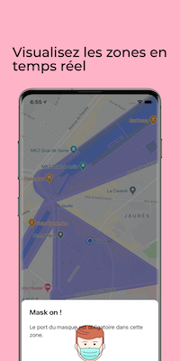

<h1 align="center">Paris Masqué 😷</h1>
<p>
  
  <a href="https://twitter.com/Jeremie__" target="_blank">
    
  </a>
</p>

> Paris Masqué vous previent lorsque vous entrez dans une zone où le port du masque est obligatoire

  |  


## Installation

```sh
yarn install
```

## Utilisation

```sh
expo start
```

## Auteur

👤 **Jérémie Zarca**

* Website: https://jzarca01.github.io
* Twitter: [@Jeremie\_\_](https://twitter.com/Jeremie\_\_)
* Github: [@jzarca01](https://github.com/jzarca01)

## 🤝 Contributing

Contributions, issues et feature requests sont les bienvenus!
<br />Vous pouvez explorer la [section Issues](https://github.com/jzarca01/paris-masque/issues).

## Montrez votre soutien

Donnez une ⭐️ si ce projet vous a été utile!
